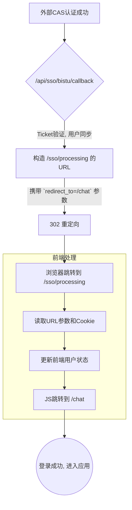
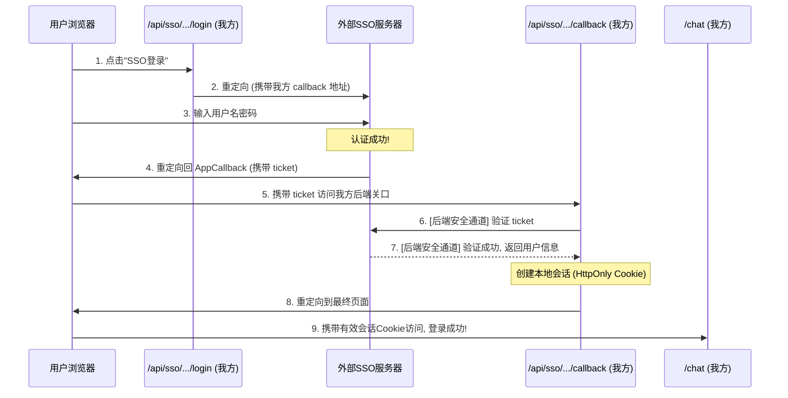

# SSO 登录认证流程详解

本文档旨在详细阐述 AgentifUI 项目中的单点登录（SSO）认证流程，涵盖旧有的、针对特定提供商（北信科）的独立实现，以及新的、通用的 SSO 管理系统实现。主要目的是澄清一个核心问题：**为什么外部 SSO 系统认证成功后，必须先跳转到后端的 `callback` 地址，而不是直接跳转到最终的应用页面（如 `/chat`）？**

## 1. 旧 `bistu` 独立实现流程：中间页的运用

在旧的、为北信科（BISTU）CAS 服务硬编码的流程中，认证成功后的跳转是一个分两步走的"接力"过程，依赖一个前端中间页来完成。

**核心逻辑**：后端 API 完成认证后，将浏览器重定向到应用内的一个特殊页面 `/sso/processing`，并把最终目标地址作为 URL 参数传递。该前端页面负责同步前端状态，然后再跳转到最终目的地。

### 代码实现 (`app/api/sso/bistu/callback/route.ts`)

```typescript
// ...经过一系列的ticket验证和用户创建/查找之后...

// 1. 构造一个指向应用内 /sso/processing 页面的 URL
const successUrl = new URL('/sso/processing', appUrl);
successUrl.searchParams.set('sso_login', 'success');

// 2. 将最终要去的地址（如 /chat）作为参数 `redirect_to` 附加在 URL 上
successUrl.searchParams.set('redirect_to', returnUrl);
successUrl.searchParams.set('user_id', user.id);
// ... 其他用户信息

// 3. 后端发起重定向，将用户浏览器导向 /sso/processing 页面
const response = NextResponse.redirect(successUrl);

// 4. 同时，设置一个前端可读的 Cookie，方便前端获取用户信息
response.cookies.set('sso_user_data', JSON.stringify(ssoUserData), {
  httpOnly: false, // 允许JS读取
  //...
});

return response;
```

### 流程图



这种方式虽然可行，但增加了前端的复杂性，需要一个专门的页面来处理后续逻辑。

---

## 2. 新通用 SSO 系统：标准的回调机制

新的、可扩展的 SSO 系统遵循了所有标准协议（如 CAS, OAuth2, OIDC）的最佳实践。其核心在于**职责分离**和**安全性**，这也是为什么必须存在一个后端 `callback` 端点的原因。

整个流程分为两个主要阶段：

### 阶段一：发起认证（"去认证"）

此阶段由 `app/api/sso/[providerId]/login/route.ts` 控制。它的核心任务是生成一个指向外部 SSO 提供商的 URL，并明确告知对方认证成功后应该将用户送回何处。

```typescript
// app/api/sso/[providerId]/login/route.ts

// ...
const ssoService = await SSOServiceFactory.createService(provider);

// 生成指向外部SSO的URL，其中包含了我们的回调地址
const loginUrl = ssoService.generateLoginURL(returnUrl || undefined);

// 重定向到外部SSO提供商
return NextResponse.redirect(loginUrl);
```

例如，对于 CAS 协议，生成的 `loginUrl` 会是这样：
`https://cas.bistu.edu.cn/login?service=https://agent.bistu.edu.cn/api/sso/[providerId]/callback`

这里的 `service` 参数（在 OAuth/OIDC 中称为 `redirect_uri`）是关键。它是我方向外部 SSO 系统注册的**回调地址**，外部系统只信任这个地址。

### 阶段二：处理回调与建立会话（"回应用"）

当用户在外部 SSO 系统成功认证后，浏览器会被重定向到我们在阶段一中提供的 `callback` 地址。这个地址，即 `app/api/sso/[providerId]/callback/route.ts`，是一个至关重要的**后端安全关口**。

**为什么不能直接跳转到 `/chat` 这样的前端页面？**

因为 `/chat` 页面不具备验证 `ticket`（一种一次性的认证凭证）的能力。`ticket` 必须通过**后端到后端的安全通道**进行验证，以防在前端被窃取或伪造。

`callback` API 的职责如下：

1.  **接收凭证**: 从 URL 中安全地接收 `ticket`。
2.  **安全验证**: 调用 `ssoService.validateAuth(authParams)`。此方法会从**我方服务器**向**外部SSO服务器**发起一个直接的 API 请求，验证 `ticket` 的有效性并换取用户信息。此过程对用户浏览器透明。
3.  **用户同步**: 使用 `UserSyncService.syncUser()` 在我方数据库中创建或更新用户信息。
4.  **建立会话**: 验证成功后，为用户创建应用内的会话，通常是生成一个**安全的、`HttpOnly` 的 Cookie**。
5.  **最终重定向**: 在所有后端工作完成后，发出最后一次重定向，将用户安全地引导至他们最初想要访问的前端页面（`returnUrl`）。

```typescript
// app/api/sso/[providerId]/callback/route.ts

// ...经过 ticket 验证和用户同步 ...

// 1. 构建最终的成功跳转URL，这里的 returnUrl 就是 /chat
const successUrl = new URL(returnUrl, request.url);
const response = NextResponse.redirect(successUrl);

// 2. 在重定向前，将我们自己系统的会话 Cookie 附加到响应中
response.cookies.set('sso-session', sessionToken, {
  httpOnly: true, // 安全的、仅后端可访问的Cookie
  //...
});

return response; // <-- 用户浏览器收到此响应，最终跳转到 /chat
```

---

## 3. 流程对比与总结

标准的 SSO 流程是一个严谨、安全的"接力赛"。



**结论**：您观察到的 `.../callback?ticket=...` 链接，并非认证的终点，而是整个 SSO 流程中**承上启下的、不可或缺的关键安全环节**。它标志着外部认证的结束和我方内部会话的开始，是所有标准 SSO 方案的基石。
